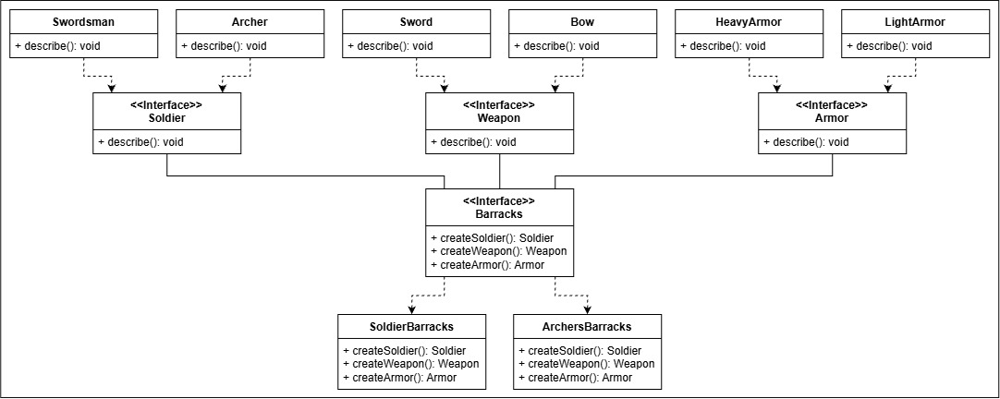

<html>
  <body>
    <h3>
      Scenario
    </h3>
    <blockquote>
      You have two types of barracks, one produces swordsmen, swords, and heavy armor, the other produces archers, bows, and light armor. In this example, the
      barracks are concrete implementations of an abstract factory; the family of products it produces being soldiers, weapons, and armor.
    </blockquote>
    <h3>
      Technical Explanation
    </h3>
    <blockquote>
      The abstract factory is a creational design pattern. It gives a way of creating families of products without specifying their concrete classes.
    </blockquote>
    <h3>
      According to the GoF
    </h3>
    <blockquote>
      "Provide an interface for creating families of related or interdependent objects without naming their concrete classes."
    </blockquote>
    <h3>
      Components
    </h3>
    <ul>
      <li>Product Interface</li>
      <li>Concrete Products</li>
      <li>Factory</li>
    </ul>
  </body>
</html>

## UML Diagram



---

Product Families - The class interfaces that the factory is responsible for creating.
```java
interface Soldier {

    void describe();
}

interface Weapon {

    void describe();
}

interface Armor {

    void describe();
}
```
Concrete Products - The subclasses that are produced by the factories.
```java
class Swordsman implements Soldier {

    public void describe() {
        System.out.println("The swordsman wields a sword and wears heavy armor.");
    }
}

class Sword implements Weapon {

    public void describe() {
        System.out.println("A sword is used for slashing and cutting down foes.");
    }
}

class HeavyArmor implements Armor {

    public void describe() {
        System.out.println("A heavy armor deflects strong blows.");
    }
}

class Archer implements Soldier {

    public void describe() {
        System.out.println("The archer wields a bow and wears light armor armor.");
    }
}

class Bow implements Weapon {

    public void describe() {
        System.out.println("A bow is used for striking foes from far away.");
    }
}

class LightArmor implements Armor {

    public void describe() {
        System.out.println("A light armor increases agility.");
    }
}
```
Abstract Factory Interface - The interface that's implemented to make a concrete Abstract Factory
```java
interface Barracks {

    Soldier createSoldier();
    Weapon createWeapon();
    Armor createArmor();
}
```
Concrete Abstract Factories - The classes that produce a family of products.
```java
class SwordsmanBarracks implements Barracks {

    public Soldier createSoldier() {
        return new Swordsman();
    }

    public Weapon createWeapon() {
        return new Sword();
    }

    public Armor createArmor() {
        return new HeavyArmor();
    }
}

class ArcherBarracks implements Barracks {

    public Soldier createSoldier() {
        return new Archer();
    }

    public Weapon createWeapon() {
        return new Bow();
    }

    public Armor createArmor() {
        return new LightArmor();
    }
}
```
Implementation
```java
public class AbstractFactory {

    public static void main(String[] args) {

        Barracks swordsmanBarracks = new SwordsmanBarracks();
        Barracks archerBarracks = new ArcherBarracks();

        Soldier swordsman = swordsmanBarracks.createSoldier();
        Weapon sword = swordsmanBarracks.createWeapon();
        Armor heavyArmor = swordsmanBarracks.createArmor();

        Soldier archer = archerBarracks.createSoldier();
        Weapon bow = archerBarracks.createWeapon();
        Armor lightArmor = archerBarracks.createArmor();
        
        swordsman.describe();
        sword.describe();
        heavyArmor.describe();
        
        System.out.println();
        
        archer.describe();
        bow.describe();
        lightArmor.describe();
    }
}
```
OUTPUT
```
- The swordsman wields a sword and wears heavy armor.
- A sword is used for slashing and cutting down foes.
- A heavy armor deflects strong blows.

- The archer wields a bow and wears light armor armor.
- A bow is used for striking foes from far away.
- A light armor increases agility.
```
